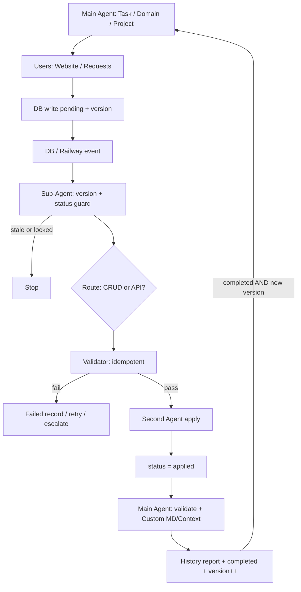

# EBFlow architecture

Source: original whiteboard/flowchart titled **Production-Ready Multi-Agent Workflow – Railway/DB Feedback Loop with Safeguards**, plus operator notes.

## Thesis

LLMs interpret and propose. Production systems need status machines, retries, versioning, idempotency, and audit trails. EBFlow wraps agents in those constraints so they can touch live systems without becoming the failure mode.

## End-to-end flow

### 1. Main Agent receives Task / Domain / Project

The main agent owns the job at a high level: intent, long-lived context, outcome checks, and completion. It is not responsible for every low-level mutation.

### 2. Users interact

Users hit a website or other request surface. Their intent becomes durable state **before** automation continues.

### 3. DB write: `pending` + version

Railway (or equivalent) + database receive:

- `status = pending`
- a `version` number
- payload + idempotency key

A crashed agent is recoverable. A lost request is not.

### 4. Event wakes Sub-Agent

A Railway notification, DB event, webhook, queue message, or poll delivers: “row changed.”

### 5. Sub-Agent guards

On receive, check **version + status** (and debounce). Stop if:

- status already handled for this role
- version is stale / already processed
- debounce lock is active

Agents may wake often. They must not act every time they wake.

### 6. Route Layer

Decision: **CRUD system** or **API layer**?

Route early so later agents stay narrow and failures classify cleanly. A CRUD validation failure and an API validation failure are different incidents.

### 7. Validator Sub-Agent (idempotent)

New sub-agent validates the change against systems. **Idempotency is required.**

On failure:

- write failed record
- retry with backoff
- or escalate to a human

On success: hand validated info (receipt) to the Second Agent.

### 8. Second Agent applies

Updates Railway / systems, sets `status = applied`.

Validation asks “is this safe and correct?”  
Application asks “make it real.”  
Do not combine these into one unsupervised step.

### 9. Main Agent closes the loop

Triggered by `applied` (or completion handoff):

- validates results
- creates Custom MD/Context that remembers steps and iterating changes
- updates History Report in DB
- sets `status = completed`
- bumps version

### 10. Controlled feedback

Return to the main agent / user loop **only if**:

`status = completed` **AND** new version detected

Safeguards:

- version check
- status guard
- debounce lock

## Status machine

```text
pending → processing → validated → applied → completed
                ↘                 ↘
                 failed ←──────────┘
                    ↓
               escalated
```

See [status-machine.md](status-machine.md) for legal transitions.

## Loop prevention (three locks)

| Guard | Purpose |
|-------|---------|
| Version check | Ignore stale or already-handled versions |
| Status guard | Only act on statuses meant for this role |
| Debounce lock | Absorb event storms / double webhooks |

Without these, a completed write re-wakes the same agent and the system eats itself.

## Memory model

| Artifact | Role |
|----------|------|
| Request row | Source of truth for status/version |
| Custom MD/Context | Main agent working memory across iterations |
| History report | Human-readable audit of why changes happened |
| Failed record | Evidence for retry/escalation |

Prefer state in DB + files over “the model will remember.”

## Design principles

1. **State beats vibe** — progress lives in status/version, not only chat context.
2. **Idempotency is not optional** — especially validation and apply.
3. **Status machines are operable** — ask “where did state stop?” not “what did the model feel?”
4. **Human escalation is product design** — some cases must stop.
5. **Loop control is the architecture** — chaining agents is easy; deciding when they may start again is hard.

## Suggested deployment shape (Railway-oriented)

```text
[Website/API] → [Postgres on Railway]
                      ↓ notify / webhook / queue
              [Worker: Ingress Sub-Agent]
                      ↓
              [Worker: Validator] → failed/escalated
                      ↓ receipt
              [Worker: Applier] → applied
                      ↓
              [Worker/Session: Main Agent] → context + history + completed + version++
```

Workers can be the same codebase with role flags, or separate services. Permissions should differ: validator ideally read-mostly; applier write-scoped.

## Mermaid reference


