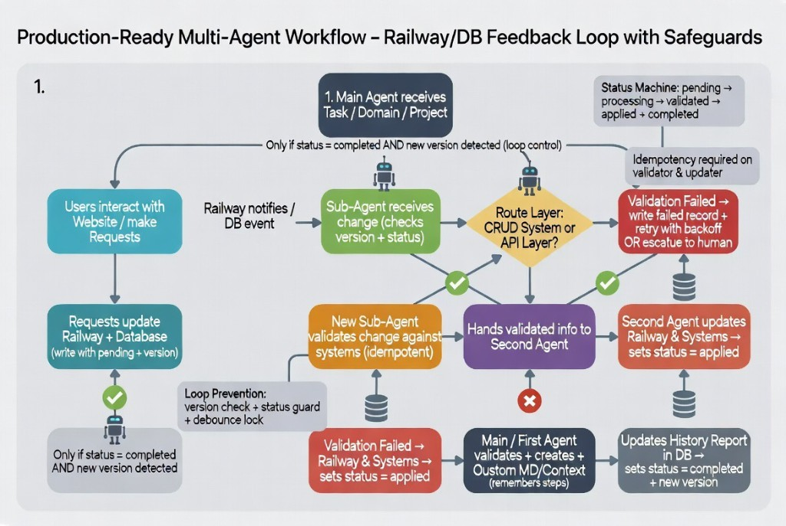

# EBFlow

**Site:** [ezra-black.github.io/EB-Flow](https://ezra-black.github.io/EB-Flow/)  
**Starter:** [starters/railway-postgres](starters/railway-postgres/) — Postgres schema + LISTEN/NOTIFY worker stub for Railway



**Install this before your agents eat themselves.**

Multi-agent demos talk. Production fails quieter: a webhook fires twice, a half-validated write sticks, a `completed` row wakes the same worker again. EBFlow is the skill you paste into Cursor, Claude, Codex, Gemini, or Grok so the agent builds a status machine, version gate, and debounce lock *before* it touches your DB.

One install prompt. Schemas + Railway/Postgres starter included. The rule: only continue if `status = completed` **and** a new version shows up.

## The rule

> Only continue if `status = completed` **and** a new version is detected.

Guards: version check + status guard + debounce lock.

## Status machine

`pending → processing → validated → applied → completed`

Failure path: `failed` → retry with backoff → `escalated` (human).

## How the loop works

1. **Main Agent** receives a task / domain / project  
2. **Users** hit a website or API  
3. Request lands in the DB as `pending` + `version`  
4. DB/Railway event wakes a **Sub-Agent**  
5. Sub-Agent checks version + status (stops if stale)  
6. **Route Layer** chooses CRUD or API  
7. **Validator** runs (must be idempotent) — fail → record / retry / escalate  
8. **Second Agent** applies change → `applied`  
9. **Main Agent** verifies, writes Custom MD/Context + history → `completed` + version bump  
10. Loop returns only on completed + new version  

## Install

Paste into Cursor, Claude Code, Codex, Gemini, or Grok:

```text
Install this skill globally: https://github.com/Ezra-Black/EB-Flow
```

Or vendor into a project:

```bash
git clone https://github.com/Ezra-Black/EB-Flow.git
# Cursor
mkdir -p your-app/.cursor/skills/ebflow
cp EBFlow/SKILL.md your-app/.cursor/skills/ebflow/
cp -R EBFlow/skills/ebflow/* your-app/.cursor/skills/ebflow/
```

Per-harness details:

| Harness | Guide |
|---------|--------|
| Cursor | [adapters/cursor.md](adapters/cursor.md) |
| Claude | [adapters/claude.md](adapters/claude.md) |
| Codex / ChatGPT | [adapters/codex.md](adapters/codex.md) |
| Gemini | [adapters/gemini.md](adapters/gemini.md) |
| Grok | [adapters/grok.md](adapters/grok.md) |

## Railway + Postgres starter

Prefer the reference integration over copy-paste:

→ **[starters/railway-postgres](starters/railway-postgres/)**

- SQL migration for `ebflow_requests` / history / status transitions (matches JSON schemas + status machine)
- Optional `LISTEN ebflow_events` wake path + Python claim stub
- Deploy notes for Railway Postgres plugin, env vars, webhook vs notify

## Use

**1. Discover (always first)**

```text
/ebflow
Start discovery for <domain>. Ask the must-answer questions before scaffolding.
```

The skill will ask about entry points, DB/Railway setup, CRUD vs API targets, failure/escalation policy, debounce, and which harness runs which role. Full bank: [skills/ebflow/discovery.md](skills/ebflow/discovery.md).

**2. Scaffold**

```text
/ebflow scaffold
Use my discovery answers. Produce config, schema, role prompts, and a test plan.
```

**3. Operate a cycle**

```text
/ebflow operate
Request id req_123 just became applied. Run main-agent completion steps.
```

**4. Eval**

```text
/ebflow eval
Check this design/implementation against eval.md.
```

## Files

| Path | Purpose |
|------|---------|
| [SKILL.md](SKILL.md) | Canonical agent instructions |
| [eval.md](eval.md) | Pass/fail checks before you ship |
| [skills/ebflow/](skills/ebflow/) | Architecture, discovery, roles, templates |
| [schemas/](schemas/) | JSON schemas for request/status/history/config |
| [starters/railway-postgres/](starters/railway-postgres/) | Railway Postgres schema + worker stub |
| [docs/](docs/) | GitHub Pages site (NERV-inspired theme) |
| [adapters/](adapters/) | Cursor, Claude, Codex, Gemini, Grok install notes |
| [assets/architecture-flowchart.png](assets/architecture-flowchart.png) | Original architecture diagram |
| [.codex-plugin/plugin.json](.codex-plugin/plugin.json) | Codex/ChatGPT plugin metadata |
| [agents/openai.yaml](agents/openai.yaml) | Codex agent interface |
| [scripts/build_plugin.py](scripts/build_plugin.py) | Build plugin ZIP |

## Why this exists

Most multi-agent demos stop at “the agents talked to each other.” Real systems need durable requests, idempotent validation, separated apply, audit history, and a hard stop on recursion.

EBFlow is that control plane as a portable skill: plug it into the major AI harnesses, answer the discovery questions, and implement against your DB.

## License

MIT
